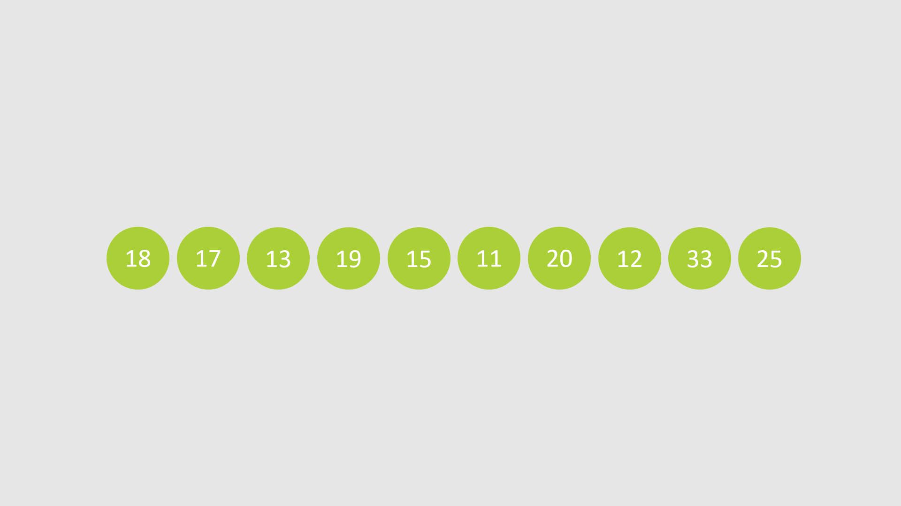
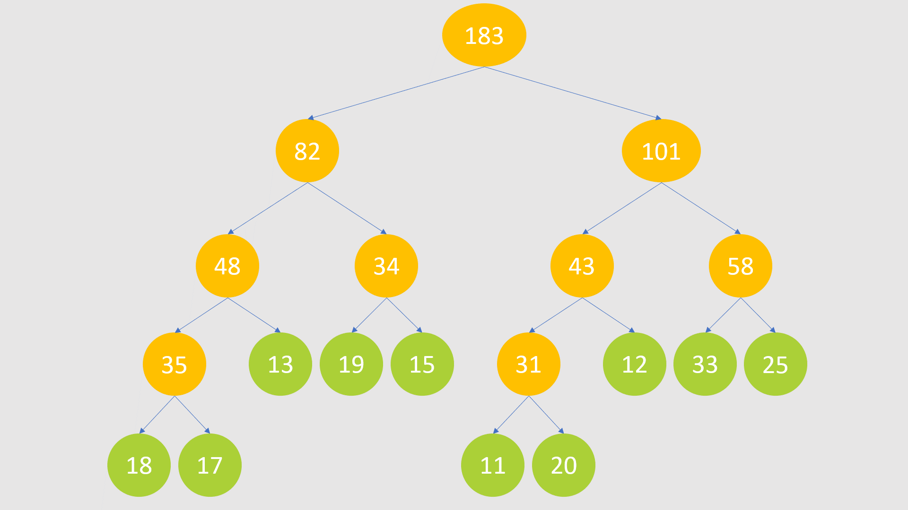
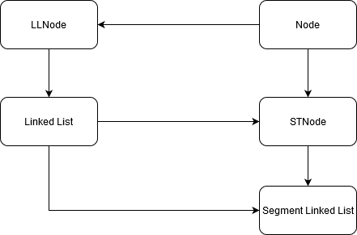

# SLL---Segment-Linked-List (Danh sách liên kết phân đoạn)
The combination of Segment Tree and Linked List  
Sự kết hợp giữa Segment Tree (cây phân đoạn) và Linked List (danh sách liên kết)

# Danh sách liên kết
Danh sách liên kết là một cấu trúc dữ liệu được sử dụng rất phổ biến trong lập trình.  

Danh sách liên kết là một tập hợp các phần tử dữ liệu, tuy nhiên các phần tử này không liền kề nhau trên địa chỉ vật lý. 
Thay vào đó, mỗi phần tử được tạo ra trên một vùng nhớ ngẫu nhiên và địa chỉ của vùng nhớ đó được trỏ đến (hay lưu trữ) bởi phần tử ngay trước nó trong danh sách. 

Để lưu trữ một danh sách liên kết, ta chỉ cần biết địa chỉ của phần tử đầu tiên (head) và phần tử cuối cùng (tail) của danh sách liên kết đó.

*
 Minh họa danh sách liên kết 
*

Ưu điểm của dánh sách liên kết so với mảng:  
1. Kích thước danh sách liên kết là động và không cần phải khai báo trước số lượng phần tử tối đa, đồng nghĩa với việc không cần tạo ra một vùng nhớ trống để giữ chỗ cho các phần tử khác.
2. Thời gian thêm, chèn, xóa một phần tử có độ phức tạp hằng số `O(1)` nếu biết địa chỉ ô nhớ của phần tử đó.

Nhược điểm của danh sách liên kết so với mảng:
1. Truy cập một phần tử tại một vị trí nhất định có độ phức tạp tuyến tính.
2. Mặc dù thêm, chèn hay xóa một phần tử trong danh sách liên kết nhanh hơn mảng, tuy nhiên đó là trường hợp biết trước địa chỉ ô nhớ của phần tử đó - một thao tác có độ phức tạp tuyến tính nếu thực hiện việc tìm kiếm thông thường.

# Cây phân đoạn
Segment Tree là một cây, cụ thể hơn, nó là một cây nhị phân đầy đủ (mỗi nút là lá hoặc có đúng 2 nút con), với mỗi nút quản lý một đoạn trên dãy số. Thông tin mà một nút quản lý trên một đoạn có thể là giá trị lớn nhất của đoạn, miền giá trị của đoạn,...

*
 Ví dụ về cây phân đoạn quản lý tổng của đoạn 
*

*
 Cách tạo cây phân đoạn quản lý tổng của đoạn từ một mảng cho trước 
*

Các thao tác trong cây phân đoạn gồm:
1. Truy vấn thông tin trong một đoạn liên tiếp bất kỳ.
2. Cập nhật lại thông tin của cây khi có bất kỳ sự thay đổi nào của các node.

*
 Cách truy vấn tổng của một đoạn liên tiếp (màu xanh nước biển) 
*

*
 Cách cập nhật giá trị của một node (màu xanh nước biển) 
*

Ưu điểm của cây phân đoạn là các thao tác truy cập và cập nhật có độ phức tạp O(logN), với N là số lượng các nút lá, nhanh hơn các thao tác tương ứng trên danh sách liên kết với độ phức tạp tuyến tính O(N).

Nhược điểm của cây phân đoạn là thường được xây dựng trên mảng, do đó khó khăn trong việc xóa hoặc chèn phần tử vì các thao tác này khi thực hiện trên mảng có độ phức tạp tuyến tính O(n), làm mất đi ưu điểm truy cập và cập nhật nhanh của cây phân đoạn.

# Ý tưởng
Với mong muốn tận dụng tối đa khả năng tốc độ các thao tác thêm, chèn, xóa các phần tử trong danh sách liên kết và cây phân đoạn, chúng tôi tạo ra một loại cấu trúc dữ liệu mới có tên là Danh sách liên kết phân đoạn (Segment Linked List). Cấu trúc dữ liệu này là một danh sách liên kết và được quản lý bằng cây phân đoạn. Thông tin mà cây phân đoạn quản lý là số lượng phần tử của đoạn đó.

*
 Ví dụ về một Danh sách liên kết phân đoạn với các đoạn quản lý số lượng phần tử của đoạn đó
*

Với ưu điểm của cây phân đoạn, thao tác truy vấn đến một phần tử có vị trí bất kỳ trong danh sách liên kết có độ phức tạp là O(logN) thay vì O(N).

Các thao tác khác của danh sách liên kết phân đoạn gồm:
* Thêm một phần tử vào cuối danh sách
* Chèn một phần tử vào giữa danh sách
* Xóa một phần tử

Các thao tác trên đều có độ phức tạp O(logN).

# Sơ đồ lớp (Class Diagram)

